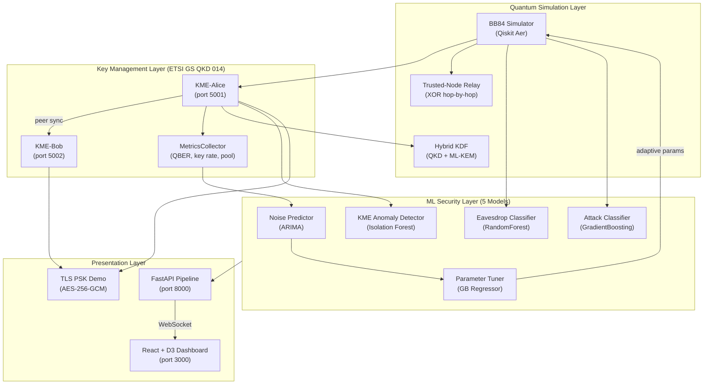
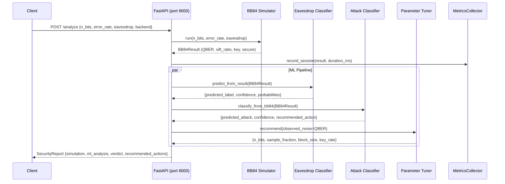
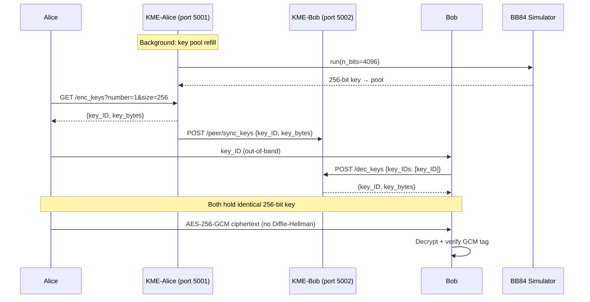
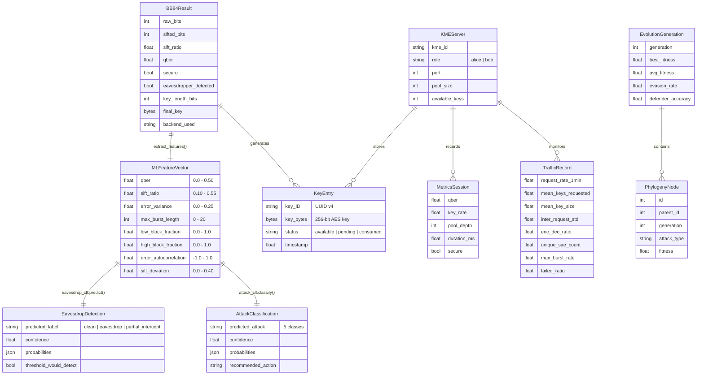

# Capstone Project Planning Document

**Project:** ML-Augmented Quantum Key Distribution for Enterprise Security
**Student:** John Jepsen
**Program:** MSCS
**Date:** April 27, 2026

---

## 1. Requirements

### Functional Requirements

- Simulate the BB84 quantum key distribution protocol using IBM Qiskit quantum circuits with configurable depolarizing noise, intercept-resend eavesdropping, and dual-backend support (Qiskit Aer / classical fallback)
- Generate deterministic 256-bit symmetric keys through the full BB84 pipeline: qubit preparation (X/H gates), basis sifting, QBER estimation, Cascade error correction, and BLAKE2b privacy amplification
- Serve QKD-derived keys via an ETSI GS QKD 014-compliant REST API (enc_keys, dec_keys, status endpoints) backed by a thread-safe key pool with automatic background refill
- Support dual-KME deployment (Alice port 5001, Bob port 5002) with peer key synchronization over HTTP
- Demonstrate end-to-end TLS PSK key exchange: Alice fetches key from KME, transmits key_ID out-of-band, Bob retrieves matching key, both encrypt/decrypt via AES-256-GCM with zero classical key agreement
- Detect eavesdropping using a RandomForest classifier trained on 8 BB84 signal features (QBER, sift ratio, error variance, max burst length, low/high block fractions, error autocorrelation, sift deviation), replacing the static 11% QBER threshold
- Classify attack types (clean, intercept-resend, beam-splitting, PNS, Trojan horse) using a 5-class GradientBoosting model
- Forecast QBER time-series values using an ARIMA(2,1,2) model with configurable alert threshold
- Recommend optimal BB84 parameters (n_bits, sample_fraction, block_size) via a GradientBoosting Regressor tuned to current noise conditions
- Detect KME traffic anomalies (DoS, resource exhaustion) using an Isolation Forest model on 8 traffic features
- Expose all ML models through a unified FastAPI REST service with individual and combined pipeline endpoints
- Co-evolve adversarial attack strategies against defender models using a DEAP evolutionary gym with physics-bounded perturbations and adversarial retraining each generation
- Stream live evolutionary gym results to a React dashboard via WebSocket
- Visualize adversarial evolution (evasion rate vs. defender accuracy, phylogeny tree, model confidence heatmap, hardening comparison) in real-time using D3
- Support hybrid QKD+ML-KEM (NIST FIPS 203) key derivation via HKDF-SHA256 per ETSI TS 104 015
- Implement trusted-node relay network with XOR hop-by-hop key relay for extending QKD range beyond single-link distance
- Provide vendor abstraction layers for ID Quantique, Toshiba, QuantumCTek, and QuintessenceLabs QKD hardware

### Non-Functional Requirements

- **Performance:** BB84 simulation completes in <5 seconds for 4096 qubits on the classical backend; FastAPI /analyze endpoint returns unified security report in <10 seconds including quantum simulation
- **Security:** All key material handled in-memory only; no keys persisted to disk outside of demo contexts; AES-256-GCM for all symmetric encryption; HKDF-SHA256 for key derivation
- **Accuracy:** Eavesdrop classifier ≥93% accuracy; attack classifier ≥96% accuracy; ARIMA QBER forecast MAE ≤0.006; parameter tuner R² ≥0.85; KME anomaly detection rate ≥86%
- **Reliability:** KME key pool auto-refills when depleted; API returns structured error responses (HTTP 503) for missing models with actionable messages
- **Accessibility:** FastAPI auto-generated OpenAPI docs at /docs; all API responses in JSON; frontend dark theme with colorblind-accessible double-encoding (color + shape)
- **Maintainability:** Single source of truth for ML feature extraction (features.py); all ML models loadable from pickle files; one-shot training via train_all_models.py
- **Portability:** Pure Python implementation; no quantum hardware required; runs on macOS, Linux, or Windows with Python 3.10+

### System Constraints and Limitations

- BB84 simulation runs on a classical simulator (Qiskit Aer), not actual quantum hardware — key generation rate is orders of magnitude slower than production QKD systems
- QKD fiber distance limited to ~100 km per link without trusted-node relay (physics constraint, not software)
- ML models trained on synthetic data generated by the simulator; real-world deployment would require retraining on hardware-derived datasets
- ARIMA noise predictor requires retraining at startup from CSV data (not persisted as pickle)
- Isolation Forest KME anomaly detector trained only on normal traffic — contamination rate is a tunable hyperparameter (default 5%)
- WebSocket evolution streaming uses a simple global state model; concurrent evolution runs are blocked

### Assumptions and Dependencies

- Python 3.10+ runtime environment
- IBM Qiskit 2.x and Qiskit Aer 0.17.x available via pip (no IBM Quantum account required for local Aer simulation)
- Pre-trained model files (eavesdrop_model.pkl, attack_model.pkl, param_tuner_model.pkl) exist in implementation/data/ or can be regenerated via train_all_models.py
- Training datasets (CSV files) exist in implementation/data/ or can be regenerated
- Node.js 18+ for frontend development server
- No external database required — all state is in-memory or file-based
- Network access only needed between local services (KME ports 5001/5002, FastAPI port 8000, Vite port 3000)

### Hardware Interfaces

- None required — the system simulates quantum hardware via Qiskit Aer
- Optional: IBM Quantum hardware backend via qiskit-ibm-runtime (requires IBM Quantum account and Plan 1+)
- Optional: vendor QKD hardware via abstraction layers (vendor_idq.py, vendor_toshiba.py, vendor_quantumctek.py, vendor_quintessence.py)

### Memory / Resource Constraints

- BB84 simulation with 65,536 qubits (maximum) requires ~512 MB RAM on Qiskit Aer backend
- Pre-trained ML model files total ~7 MB on disk (eavesdrop 2.6 MB, attack 3.8 MB, param_tuner 448 KB)
- Evolutionary gym with population_size=200 and n_generations=200 may consume up to 1 GB RAM during co-evolution
- Frontend D3 visualizations render up to 200 generations of evolution data in-browser

### External Systems to Interface With

| System | Interface | Purpose |
|--------|-----------|---------|
| IBM Qiskit Aer | Python library (local) | Quantum circuit simulation backend |
| ETSI GS QKD 014 API | REST (self-hosted) | Key management standard API |
| GitHub Pages | Static hosting | Frontend dashboard deployment |
| GitHub Actions | CI/CD | Automated testing and deployment |

### User Interfaces

1. **FastAPI OpenAPI Dashboard** — Auto-generated interactive API documentation at /docs for all 11 REST endpoints; allows direct testing of the full ML pipeline
2. **Adversarial Evolution Dashboard** — React + D3 real-time visualization dashboard (port 3000) with 6 components: EvolutionChart, PhylogenyTree, ModelConfidence, HardeningComparison, Controls, StatusPanel
3. **Terminal CLI** — Direct Python script execution for BB84 simulation, KME server operation, and TLS PSK demos

---

## 2. System Design

### High-Level Architecture Overview

The system is organized into four layers: a quantum simulation layer that generates raw key material, a key management layer that stores and dispenses keys via a standards-compliant REST API, an ML security layer that monitors channel health and detects adversarial behavior, and a presentation layer that exposes the pipeline via REST/WebSocket and visualizes adversarial co-evolution.

The closed-loop design is the core architectural innovation: the noise predictor feeds the parameter tuner, which adjusts BB84 simulator parameters proactively — before QBER rises above the 11% abort threshold. This replaces the traditional static-threshold approach with an adaptive, ML-driven feedback loop.



### Data Flow: Key Workflows

#### Flow 1: Full Pipeline Analysis (POST /analyze)



#### Flow 2: TLS PSK Key Exchange via KME



### Components, Modules, and Interfaces

| Module | File | Interface | Depends On |
|--------|------|-----------|------------|
| BB84 Simulator | `bb84_simulator.py` | `BB84Protocol.run(n_bits) → BB84Result` | Qiskit Aer |
| KME Server | `kme_server.py` | Flask REST: `/enc_keys`, `/dec_keys`, `/status` | BB84 Simulator |
| Dual KME | `kme_dual.py` | Flask REST (ports 5001/5002) + peer sync | BB84 Simulator |
| TLS PSK Demo | `tls_psk_demo.py` | CLI: `python tls_psk_demo.py client\|server` | KME Server, `cryptography` |
| Hybrid KDF | `hybrid_kdf.py` | `HybridKeyExchange.initiate() / .respond()` | `cryptography` (HKDF) |
| Relay Network | `relay_network.py` | `QKDRelayNetwork.relay_key(src, dst) → key` | BB84 Simulator |
| Feature Extraction | `features.py` | `extract_features(BB84Result) → np.array[8]` | NumPy |
| Eavesdrop Classifier | `ml_eavesdrop_classifier.py` | `.predict_from_result(BB84Result) → Detection` | scikit-learn, features.py |
| Attack Classifier | `ml_attack_classifier.py` | `.classify_from_bb84(BB84Result) → Detection` | scikit-learn, features.py |
| Noise Predictor | `ml_noise_predictor.py` | `.fit(series)`, `.forecast(steps) → Forecast` | statsmodels (ARIMA) |
| Parameter Tuner | `ml_parameter_tuner.py` | `.recommend(noise) → Recommendation` | scikit-learn |
| KME Anomaly Detector | `ml_kme_anomaly.py` | `.detect(TrafficRecord) → AnomalyResult` | scikit-learn (Isolation Forest) |
| Physics Constraints | `physics_constraints.py` | `PhysicsConstraints.clip(features) → features` | NumPy |
| Adversarial Eval | `adversarial_eval.py` | `evaluate_evasion()`, `adversarial_retrain()` | scikit-learn, physics_constraints |
| Adversarial Gym | `adversarial_gym.py` | `AdversarialGym.evolve() → EvolutionResult` | DEAP, scikit-learn |
| FastAPI Pipeline | `api.py` | REST + WebSocket (port 8000) | All ML modules |
| Metrics Collector | `metrics.py` | `MetricsCollector.record_session()` | None |
| React Dashboard | `frontend/src/App.jsx` | WebSocket client, D3 visualizations | FastAPI WebSocket |

### Key Algorithms

- **BB84 Protocol:** Qubit encoding via X (bit-flip) and H (Hadamard) gates on Qiskit quantum circuits; basis sifting discards mismatched-basis measurements; Cascade block-based error correction; BLAKE2b privacy amplification compresses sifted key to 256 bits
- **Eavesdropper Simulation:** Two-circuit intercept-resend model — Eve measures Alice's qubits in random basis, re-prepares new qubits, forwards to Bob; introduces detectable QBER increase
- **Feature Engineering:** 8-dimensional feature vector extracted from BB84Result with physics-enforced bounds and covariance constraints (e.g., sift_deviation must match sift_ratio, error_variance ≤ QBER × (1 - QBER))
- **Evolutionary Co-evolution (DEAP):** Genetic algorithm evolves adversarial perturbation vectors bounded by QKD physics; defender retrains with warm_start each generation using adversarial samples mixed at configurable ratio; phylogeny tree tracks parent-child lineage across generations
- **Trusted-Node Relay:** XOR-based hop-by-hop key relay: source encrypts session_key with link key K_AB, each relay node decrypts with incoming link key and re-encrypts with outgoing link key
- **Hybrid Key Derivation:** HKDF-SHA256 with IKM = qkd_key || kem_secret; secure if either QKD or ML-KEM remains unbroken

### Data Structures

See [Section 3: Database Design](#3-database-design) for schema details. The system uses in-memory data structures rather than a persistent database.

### API Design

| Method | Path | Purpose | Request | Response |
|--------|------|---------|---------|----------|
| POST | `/analyze` | Full pipeline: BB84 + all ML models | `{n_bits, error_rate, eavesdrop, backend}` | `{simulation, ml_analysis, verdict, recommended_actions}` |
| POST | `/forecast` | QBER time-series forecast | `{steps}` | `{predicted_qber[], confidence_lower[], confidence_upper[], alert}` |
| POST | `/recommend` | Optimal BB84 parameters | `{observed_noise}` | `{recommended: {n_bits, sample_fraction, block_size}, predicted_key_rate}` |
| POST | `/detect-anomaly` | KME traffic anomaly check | `{request_rate_1min, mean_keys_requested, ...8 features}` | `{is_anomaly, anomaly_score, explanation}` |
| POST | `/adversarial-eval` | Evasion before/after hardening | `{epsilon, n_trials}` | `{before: {evasion_rate, accuracy}, after: {...}, improvement}` |
| POST | `/evolution/start` | Launch evolutionary gym | `{population_size, n_generations, epsilon, hardening_mix}` | `{status: "started", config}` |
| GET | `/evolution/status` | Current evolution state | — | `{status, generations_completed, generations[], result}` |
| GET | `/attack-tree` | Phylogeny tree from last run | — | `{nodes[], edges[]}` |
| WS | `/ws/evolution` | Live evolution stream | — | `{type: "generation"\|"complete", data}` |
| GET | `/health` | Pipeline status | — | `{status, models_loaded, models, session_stats}` |
| GET | `/models` | Loaded model details | — | `{models: {...}, total}` |
| GET | `/enc_keys` | Fetch encryption keys (KME) | `?number=N&size=S` | `{keys: [{key_ID, key}]}` |
| POST | `/dec_keys` | Retrieve key by ID (KME) | `{key_IDs: [{key_ID}]}` | `{keys: [{key_ID, key}]}` |
| GET | `/status` | KME key pool status | — | `{source_KME_ID, available_keys, ...}` |

### Languages, Frameworks, and Tools

| Category | Technology | Version |
|----------|-----------|---------|
| **Backend** | Python | 3.10+ |
| **Quantum Simulation** | IBM Qiskit | 2.x |
| **Quantum Simulation** | Qiskit Aer | 0.17.x |
| **Key Management API** | Flask | 3.x |
| **ML Pipeline API** | FastAPI / Uvicorn | 0.115+ / 0.34+ |
| **ML / Data Science** | scikit-learn | 1.3+ |
| **Time-Series** | statsmodels (ARIMA) | 0.14+ |
| **Evolutionary Algorithms** | DEAP | 1.4+ |
| **Cryptography** | `cryptography` library | 41.0+ |
| **HTTP Client** | requests | 2.31+ |
| **Frontend** | React | 19.x |
| **Visualization** | D3.js | 7.9 |
| **Build Tool** | Vite | 8.x |
| **Deployment** | GitHub Pages + GitHub Actions | — |
| **Version Control** | Git / GitHub | — |

### Database Choice

No persistent database — all state is held in-memory (key pools, model objects, metrics, evolution state) or in flat files (CSV datasets, pickle models). This is appropriate because the system is a reference architecture and simulation environment, not a production service managing persistent user data. File-based storage keeps the stack simple and eliminates operational dependencies.

---

## 3. Database Design

### Entity-Relationship Diagram

The system uses in-memory data structures rather than a relational database. The following ER diagram represents the logical data model — the relationships between key entities as they exist at runtime.



### Schema Details

#### BB84Result (dataclass — in-memory)

| Field | Type | Constraints | Description |
|-------|------|-------------|-------------|
| raw_bits | int | ≥512, ≤65536 | Number of qubits transmitted |
| sifted_bits | int | ≤raw_bits | Bits remaining after basis sifting |
| sift_ratio | float | 0.0–1.0 | sifted_bits / raw_bits |
| qber | float | 0.0–0.50 | Quantum bit error rate |
| secure | bool | — | True if QBER < 11% threshold |
| eavesdropper_detected | bool | — | True if QBER exceeded threshold |
| key_length_bits | int | 0 or 256 | 0 if aborted, 256 if secure |
| final_key | bytes | 32 bytes or None | SHA-256 / BLAKE2b compressed key |
| backend_used | string | "qiskit" or "classical" | Simulation backend |

#### KeyEntry (dict — in-memory key pool)

| Field | Type | Constraints | Index | Description |
|-------|------|-------------|-------|-------------|
| key_ID | string | UUID v4, unique | Primary (dict key) | ETSI QKD 014 key identifier |
| key | bytes | 32 bytes (256-bit) | — | Base64-encoded symmetric key |
| status | string | available / pending / consumed | — | Key lifecycle state |
| timestamp | float | Unix epoch | — | Creation time |

#### ML Feature Vector (numpy array — 8 features)

| Index | Feature | Type | Range | Physics Constraint |
|-------|---------|------|-------|--------------------|
| 0 | qber | float | 0.0–0.50 | Channel noise floor |
| 1 | sift_ratio | float | 0.10–0.55 | ~0.50 for ideal BB84 |
| 2 | error_variance | float | 0.0–0.25 | ≤ qber × (1 - qber) |
| 3 | max_burst_length | int | 0–20 | Sequential error run |
| 4 | low_block_fraction | float | 0.0–1.0 | Blocks with 0 errors |
| 5 | high_block_fraction | float | 0.0–1.0 | Blocks with >50% errors |
| 6 | error_autocorrelation | float | -1.0–1.0 | Consecutive block correlation |
| 7 | sift_deviation | float | 0.0–0.40 | |sift_ratio - 0.5| |

#### Training Datasets (CSV — file-based)

| File | Rows | Columns | Purpose |
|------|------|---------|---------|
| eavesdrop_dataset.csv | ~10,000 | 8 features + label (clean/eavesdrop/partial_intercept) | Eavesdrop classifier training |
| attack_dataset.csv | ~10,000 | 8 features + label (5 attack classes) | Attack classifier training |
| param_tuner_dataset.csv | ~5,000 | noise_level, n_bits, sample_fraction, block_size, key_rate | Parameter tuner training |
| noise_series_dataset.csv | ~500 | timestamp, qber | ARIMA time-series training |
| kme_anomaly_dataset.csv | ~1,000 | 8 traffic features + label (normal/anomaly) | Isolation Forest training |

### Functional Requirements the Schema Satisfies

- BB84Result captures all protocol outputs needed for downstream ML analysis and key generation
- KeyEntry lifecycle (available → pending → consumed) enforces single-use key material per ETSI QKD 014
- MLFeatureVector provides a consistent 8-dimensional input contract across all classifiers
- TrafficRecord schema mirrors real KME traffic observables for anomaly detection
- EvolutionGeneration + PhylogenyNode track full lineage of evolved attack strategies across generations

### Performance Requirements

- **Key pool lookup:** O(1) dict access by key_ID — no database query overhead
- **Feature extraction:** O(1) per BB84Result — 8 scalar computations from result fields
- **ML inference:** <50ms per model prediction (scikit-learn in-memory models)
- **Evolution state:** Append-only list of generation results; broadcast per-generation via WebSocket
- **Scaling:** Current design supports single-node operation; horizontal scaling would require shared key store (out of scope for reference implementation)

### Logical Database Requirements

All data entities are designed as Python dataclasses, dictionaries, or numpy arrays held in process memory. File-based persistence (CSV for training data, pickle for trained models) provides reproducibility without database infrastructure.

### Software System Attributes

**Reliability:** The KME key pool auto-refills via background thread when keys are consumed, preventing pool exhaustion. BB84 simulation failures (QBER above threshold) produce structured abort responses rather than crashes. All ML model loading is guarded with existence checks and fallback error messages.

**Availability:** The FastAPI service starts in degraded mode if any model files are missing — the /health endpoint reports which models loaded and which failed. Individual endpoints return HTTP 503 with actionable error messages when their backing model is unavailable.

**Security:** Key material exists only in-memory during active sessions. AES-256-GCM provides authenticated encryption in the TLS PSK demo. Hybrid key derivation (HKDF combining QKD + ML-KEM output) provides defense-in-depth — compromise requires breaking both quantum and post-quantum components. Adversarial perturbations are bounded by physics constraints to prevent unrealizable attack vectors.

**Maintainability:** Single feature extraction module (features.py) ensures all classifiers use the same 8-feature schema. Physics constraints are centralized in physics_constraints.py. All ML models follow a consistent load/train/predict interface. The train_all_models.py script regenerates all datasets and models in one command.

**Portability:** Pure Python with pip-installable dependencies. No OS-specific code, compiled extensions, or hardware requirements. Qiskit Aer provides cross-platform quantum simulation. The frontend uses standard Vite + React with no platform-specific dependencies.

---

## 4. Project Plan

### Project Management Tool

**GitHub Projects** — Already integrated with the repository for issue tracking and milestone management. Kanban board with columns: Backlog, In Progress, Review, Done.

### Project Timeline

| Phase | Deliverables |
|-------|-------------|
| Phase 1: QKD Foundations & Research | 8 research documents (01–08), vocab study guide (245 terms) |
| Phase 2: Protocol Integration Docs | TLS 1.3 PSK mapping, IPsec RFC 8784 PPK guide, service mesh rekeying patterns |
| Phase 3: Key Management & Vendor Analysis | ETSI QKD 014 architecture, 8 vendor profiles, operational constraints |
| Phase 4: Working Implementation | BB84 simulator, KME server, TLS PSK demo, 5 ML models, FastAPI pipeline, vendor adapters |
| Phase 5: Integration, Testing & Delivery | Test suite, adversarial gym, React dashboard, capstone brief, final presentation |

### Meeting Schedule

N/A — solo project.

### Milestones

| Milestone | Description | Exit Criteria |
|-----------|-------------|---------------|
| M1: QKD Foundations | Research documentation covering BB84, CV-QKD, MDI-QKD, TF-QKD, hardware, global deployments, threat models | 8 numbered docs complete; vocab study guide with 245 terms |
| M2: Protocol Integration | TLS 1.3, IPsec/IKEv2, service mesh integration documentation | Each integration doc stands alone as practitioner reference; cross-references verified |
| M3: Key Management & Vendors | ETSI QKD 014 lifecycle, trusted-node models, 8 vendor profiles, operational constraints | All vendor profiles include: product, capability, distance specs, pricing tier, integration pattern |
| M4: Working Implementation | Runnable Python stack: BB84 → KME → TLS PSK → ML pipeline → FastAPI | `python tls_psk_demo.py client/server` runs end-to-end; all 5 ML models trained; FastAPI /analyze returns unified report |
| M5: Integration & Delivery | Test suite, adversarial gym, React dashboard, capstone brief, final presentation | All tests pass; adversarial gym co-evolves ≥10 generations; dashboard renders live; capstone brief submitted |

### Tasks per Milestone

**M1: QKD Foundations**
- Research and document BB84 protocol mechanics (encoding, sifting, QBER, error correction, privacy amplification)
- Document CV-QKD, MDI-QKD, TF-QKD variants with tradeoff analysis
- Survey global QKD deployments (EU EuroQCI, China BSBN, Japan QKD network, US programs)
- Define "harvest now, decrypt later" threat model
- Build 245-term vocabulary study guide
- Create interactive quiz (quiz.html)

**M2: Protocol Integration**
- Map QKD to TLS 1.3 PSK modes (RFC 8446 §2.2) — depends on M1
- Document IKEv2 PPK mechanism (RFC 8784) — depends on M1
- Document service mesh symmetric rekeying pattern — depends on M1
- Define hybrid QKD+PQC architecture (ETSI TS 104 015) — depends on M1

**M3: Key Management & Vendors**
- Document ETSI GS QKD 014 API lifecycle — depends on M2
- Document trusted-node relay models — depends on M1
- Profile 8 vendors with deployment specs — depends on M1, M2
- Document operational constraints (distance, cost, failure modes) — depends on vendor research

**M4: Working Implementation**
- Implement BB84 simulator on Qiskit Aer — depends on M1
- Implement KME server with ETSI 014 REST API — depends on M3
- Implement dual-KME deployment with peer sync — depends on KME server
- Implement TLS PSK demo (AES-256-GCM) — depends on KME server
- Implement hybrid KDF (HKDF-SHA256) — depends on M2
- Implement trusted-node relay network — depends on M3
- Build 5 ML models (eavesdrop, attack, noise, tuner, anomaly) — depends on BB84 simulator
- Build FastAPI pipeline unifying all models — depends on all ML models
- Build vendor abstraction layers (4 vendors) — depends on M3

**M5: Integration & Delivery**
- Write comprehensive test suite (16 test files) — depends on M4
- Implement adversarial gym with DEAP evolutionary co-evolution — depends on ML models
- Implement physics constraints for adversarial perturbation bounding — depends on M1
- Build React + D3 dashboard with 6 visualization components — depends on FastAPI WebSocket
- Write capstone brief and outline — depends on all milestones
- Prepare final presentation — depends on all milestones
- Set up GitHub Pages deployment via GitHub Actions

### Risk Analysis

**Greatest Risk: ML models trained on synthetic data may not generalize to real QKD hardware signals**

This is the single most significant risk because the entire ML security layer (5 models, the core innovation) is trained on data generated by the BB84 simulator rather than actual quantum hardware. Real-world QKD signals exhibit noise characteristics (detector dark counts, timing jitter, polarization drift) that the simulator's depolarizing noise model may not capture. Mitigation: the system architecture cleanly separates feature extraction (features.py) from model training, so retraining on hardware-derived data requires only new CSV datasets — no code changes.

**Secondary Risks:**

- **Qiskit Aer version instability:** Qiskit's rapid release cadence (2.x breaking changes from 1.x) could break quantum circuit simulation. Mitigation: pinned versions in requirements.txt; classical fallback backend eliminates hard dependency on Qiskit for core functionality.
- **GitHub Pages limitations for dynamic content:** The React dashboard requires WebSocket connections to the FastAPI backend, which GitHub Pages (static hosting) cannot serve. Mitigation: deploy frontend as static build to GitHub Pages; backend must run locally or on a separate service. Document this clearly in deployment instructions.
- **Evolutionary gym resource consumption:** Large population sizes (200) with many generations (200) can exhaust memory and take significant time. Mitigation: API enforces bounds (population ≤200, generations ≤200); concurrent evolution runs are blocked at the endpoint level.

---

## 5. Test Plan

### Testing Strategy

| Level | Tool | Scope |
|-------|------|-------|
| Unit | pytest | Individual modules: BB84 simulator, feature extraction, physics constraints, ML models, vendor adapters |
| Integration | pytest | Cross-module flows: BB84 → KME → TLS PSK; API → ML pipeline; evolution → WebSocket |
| API | pytest + httpx (FastAPI TestClient) | All 11 FastAPI endpoints: request validation, response schemas, error handling |
| Frontend | Manual | React dashboard: WebSocket connection, D3 rendering, controls interaction |

### Test Scenarios

| Scenario | Test Case | Test Data | Expected Result |
|----------|-----------|-----------|-----------------|
| BB84 clean channel | Run BB84 with error_rate=0.01, no eavesdropper | n_bits=4096, backend=classical | secure=True, QBER<0.11, 256-bit key produced |
| BB84 eavesdropper detected | Run BB84 with eavesdrop=True | n_bits=4096, error_rate=0.01 | secure=False, eavesdropper_detected=True, QBER>0.11 |
| BB84 Qiskit backend | Run BB84 on Qiskit Aer | n_bits=2048, backend=qiskit | Valid BB84Result with backend_used="qiskit" |
| KME key lifecycle | Request enc_key, then dec_key with same ID | slave_SAE_ID="bob" | Both return identical key bytes |
| KME pool refill | Exhaust key pool, wait, check status | Consume all keys | Pool auto-refills; status shows available_keys > 0 |
| Feature extraction consistency | Extract features from known BB84Result | Fixed BB84Result fixture | 8-element array matching expected values |
| Physics constraints enforcement | Clip features outside physical bounds | qber=0.6, sift_ratio=0.8 | Clipped to qber=0.50, sift_ratio=0.55 |
| Covariance constraint | Verify sift_deviation matches sift_ratio | sift_ratio=0.3 | sift_deviation = \|0.3 - 0.5\| = 0.2 |
| Eavesdrop classifier accuracy | Predict on labeled test set | Pre-generated test split | Accuracy ≥ 93% |
| Attack classifier accuracy | Classify 5 attack types on test set | Pre-generated test split | Accuracy ≥ 96% |
| ARIMA forecast | Forecast 20 steps from noise series | noise_series_dataset.csv | 20 predictions with confidence bounds; alert if any > 0.09 |
| Parameter tuner recommendation | Recommend params for noise=0.05 | observed_noise=0.05 | Returns valid n_bits, sample_fraction, block_size |
| KME anomaly detection | Detect burst traffic anomaly | request_rate=100, max_burst=50 | is_anomaly=True |
| Adversarial evasion | Perturb clean samples with epsilon=0.15 | 300-sample test set | Measurable evasion rate; hardened model reduces evasion |
| Evolutionary gym | Run 10 generations with pop=30 | Default training data | Generations complete; phylogeny tree has nodes |
| Hybrid KDF | Derive combined key from QKD + ML-KEM | Mock QKD key + mock KEM | Alice and Bob derive identical 256-bit combined key |
| Relay network | Relay key across 4-node path | NYC → Chicago → Denver → LA | Recovered key matches original session key |
| API /analyze | Full pipeline call | {n_bits: 4096, error_rate: 0.01} | JSON with simulation, ml_analysis, verdict="SECURE" |
| API /health degraded | Start API with missing model file | Remove eavesdrop_model.pkl | status="degraded", startup_errors lists missing file |
| Vendor adapter | Mock HTTP response from ID Quantique | Mocked ETSI 014 response | Adapter returns KeyEntry with valid key_ID and key |
| TLS PSK end-to-end | Run client and server | KME running on localhost | Client encrypts, server decrypts, message matches |

### Coverage Targets

- **Unit tests:** ≥85% line coverage across all Python modules
- **ML models:** All 5 models tested for accuracy thresholds (93%, 96%, MAE≤0.006, R²≥0.85, 86% detection)
- **API endpoints:** 100% endpoint coverage (all 11 endpoints tested)
- **Physics constraints:** 100% coverage of constraint functions and edge cases

### CI Integration Plan

```yaml
# .github/workflows/test.yml
name: Test Suite
on: [push, pull_request]
jobs:
  test:
    runs-on: ubuntu-latest
    steps:
      - uses: actions/checkout@v4
      - uses: actions/setup-python@v5
        with:
          python-version: "3.10"
      - run: pip install -r implementation/requirements.txt
      - run: pip install pytest pytest-cov httpx
      - run: |
          cd implementation
          python train_all_models.py
          pytest tests/ --cov=. --cov-report=xml -v
      - uses: actions/upload-artifact@v4
        with:
          name: coverage-report
          path: implementation/coverage.xml
```

---

## 6. Deployment

### Deployment Tools and Platform

| Component | Platform | Tool |
|-----------|----------|------|
| Frontend (React dashboard) | GitHub Pages | GitHub Actions (build + deploy) |
| Backend (FastAPI + KME) | Local / self-hosted | Python + Uvicorn |
| CI/CD | GitHub Actions | pytest, Vite build |

### Step-by-Step Deployment Procedure

#### Frontend (GitHub Pages)

1. Configure Vite for static build with correct base path:
   ```js
   // vite.config.js
   export default defineConfig({
     base: '/qkd-avantheir/',
     plugins: [react()],
   })
   ```

2. Create GitHub Actions workflow (`.github/workflows/deploy.yml`):
   ```yaml
   name: Deploy Frontend to GitHub Pages
   on:
     push:
       branches: [main]
       paths: ['frontend/**']
   
   permissions:
     contents: read
     pages: write
     id-token: write
   
   jobs:
     build:
       runs-on: ubuntu-latest
       steps:
         - uses: actions/checkout@v4
         - uses: actions/setup-node@v4
           with:
             node-version: 18
         - run: cd frontend && npm ci && npm run build
         - uses: actions/upload-pages-artifact@v3
           with:
             path: frontend/dist
   
     deploy:
       needs: build
       runs-on: ubuntu-latest
       environment:
         name: github-pages
       steps:
         - uses: actions/deploy-pages@v4
   ```

3. Enable GitHub Pages in repository settings → Pages → Source: GitHub Actions

4. Push to main branch — workflow triggers automatically

#### Backend (Local Development)

1. Install Python dependencies:
   ```bash
   cd implementation
   pip install -r requirements.txt
   ```

2. Train all ML models (one-time):
   ```bash
   python train_all_models.py
   ```

3. Start KME server:
   ```bash
   python kme_server.py  # port 5000
   ```

4. Start FastAPI pipeline:
   ```bash
   uvicorn api:app --reload --port 8000
   ```

5. Verify health:
   ```bash
   curl http://localhost:8000/health
   # Expect: {"status": "healthy", "models_loaded": "5/5", ...}
   ```

### Environment Variables and Secrets Management

| Variable | Purpose | Default | Where Set |
|----------|---------|---------|-----------|
| `PYTHONPATH` | Module resolution for imports | `implementation/` | Shell or .env |
| `KME_PORT` | KME server port | 5000 | CLI argument |
| `API_PORT` | FastAPI service port | 8000 | Uvicorn argument |
| `VITE_API_URL` | Backend URL for frontend | `http://localhost:8000` | `.env` in frontend/ |

No secrets are required — the system uses locally-generated quantum keys and does not connect to external authenticated services. If IBM Quantum hardware backend is used in the future, the `IBMQ_TOKEN` would need to be stored as a GitHub Actions secret.

### System Requirements

| Requirement | Minimum |
|-------------|---------|
| Python | 3.10+ |
| Node.js | 18+ |
| RAM | 2 GB (4 GB recommended for Qiskit Aer with large qubit counts) |
| Disk | 600 MB (repo + node_modules + trained models) |
| OS | macOS, Linux, or Windows |
| Network | Localhost only (ports 3000, 5000, 5001, 5002, 8000) |

### Rollback Plan

- **Frontend:** GitHub Pages maintains previous deployment; revert by pushing a fix to main or manually triggering a re-deploy from a previous commit via GitHub Actions
- **Backend:** No persistent state to roll back — restart services with previous code checkout
- **ML models:** Regenerate from scratch via `python train_all_models.py` (deterministic with fixed random seeds)
- **Git:** All changes tracked in version control; `git revert <commit>` for any problematic change

### Monitoring / Logging Approach

- **FastAPI:** Built-in Python logging (`logging.basicConfig`) with timestamps, log level, and message format (`HH:MM:SS  LEVEL  message`); startup logs report model loading status and timing
- **Health endpoint:** `GET /health` returns model status, session counts (total/secure/aborted), and any startup errors — suitable for periodic health checks
- **Metrics:** `MetricsCollector` tracks QBER, key rate, and pool depth per session; accessible via API responses
- **Frontend:** Browser console logging for WebSocket connection status and D3 rendering events
- **GitHub Actions:** Workflow run logs available in the Actions tab; build and test output captured per step
