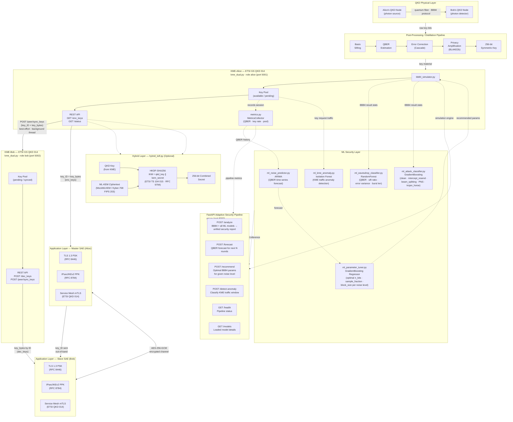
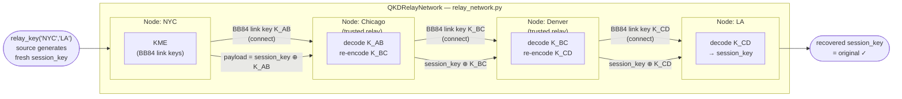
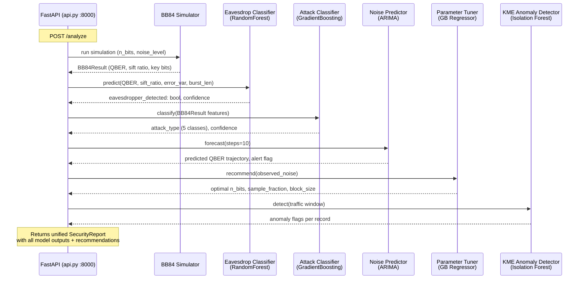
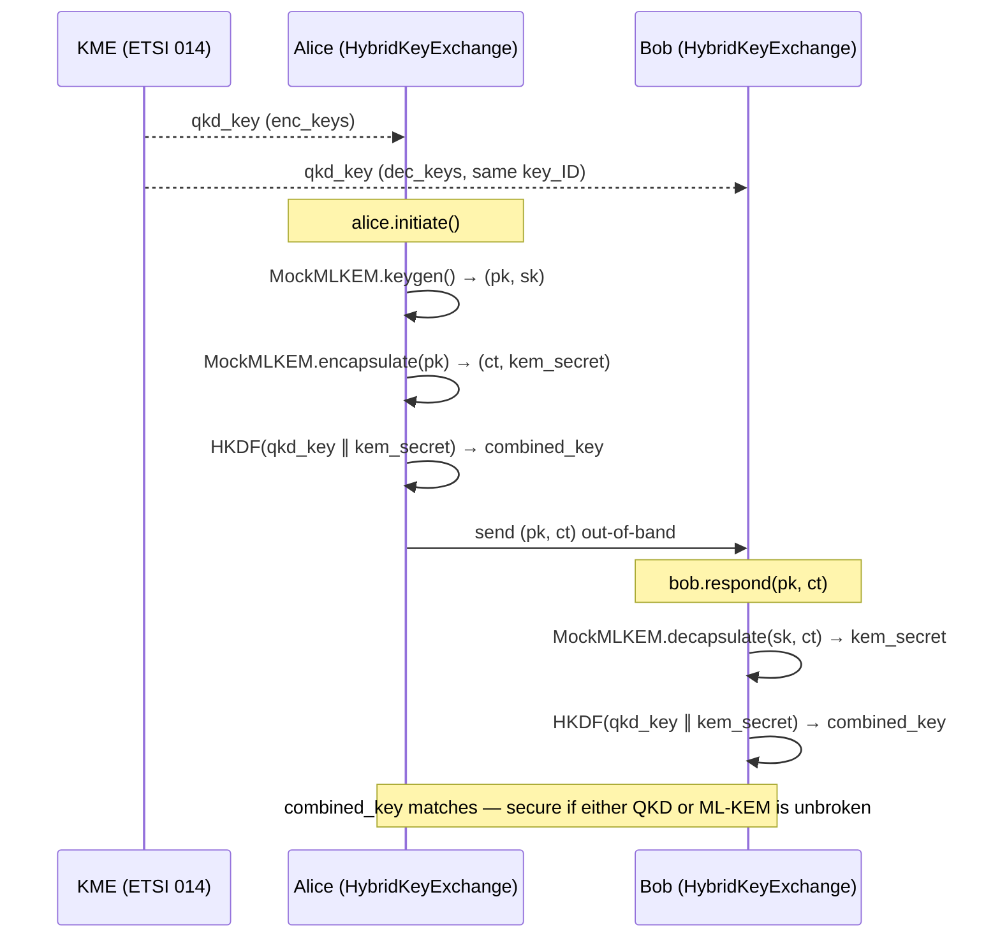

# QKD System Architecture Diagram

Supplements `capstone-outline.md`. Shows the full key delivery pipeline including the dual-KME deployment, trusted-node relay network, hybrid QKD+ML-KEM key derivation, ML security layer, FastAPI adaptive security pipeline, and metrics monitoring.

---

## Core Key Delivery Pipeline

---

## Trusted-Node Relay Network

> **Security note:** each trusted relay node transiently holds the session key in cleartext. End-to-end security requires physical security at every node. This is the same model used in the Beijing-Shanghai backbone (BSBN) and EuroQCI.

---

## ML Adaptive Security Pipeline (Closed-Loop)

> **Closed-loop design:** The noise predictor feeds the parameter tuner, which adjusts BB84 simulator parameters proactively — before QBER rises above the 11% abort threshold. The API's `/analyze` endpoint runs the full pipeline in a single call, while individual endpoints (`/forecast`, `/recommend`, `/detect-anomaly`) allow targeted queries.

---

## Hybrid Key Exchange Flow

