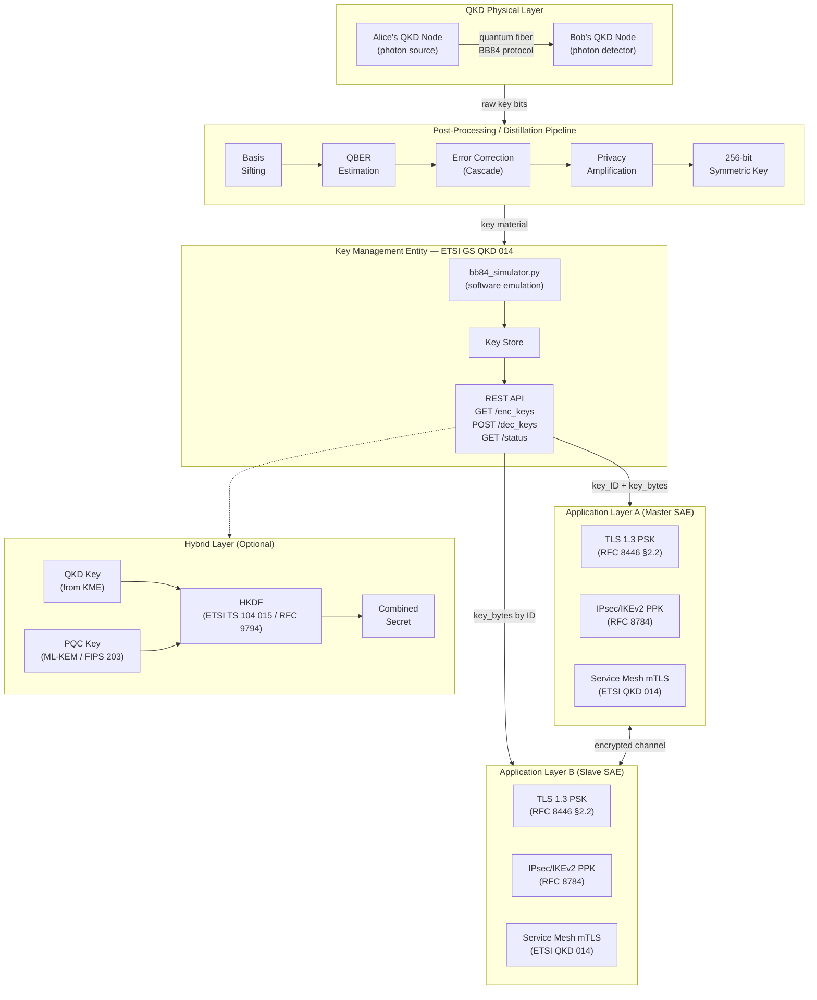

# QKD System Architecture Diagram

Supplements `capstone-outline.md`. Shows the full key delivery pipeline from QKD physical layer through post-processing, key management, and application integration to the optional hybrid layer.

