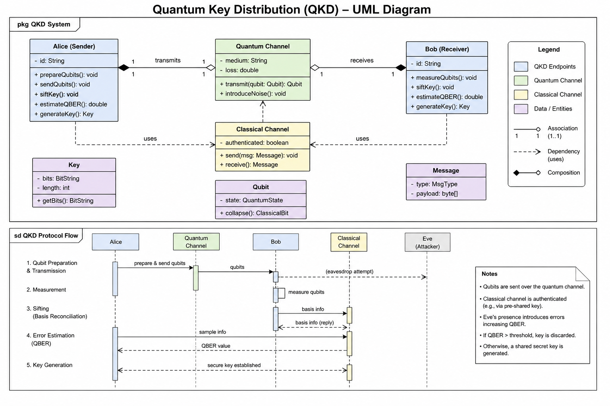
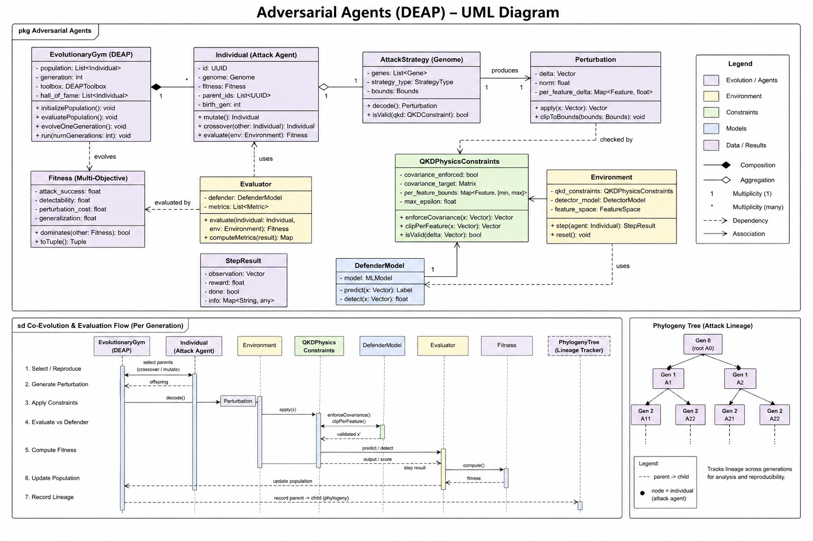

# QKD Key Infrastructure — Avantheir Initiative



ML-augmented Quantum Key Distribution for enterprise security. Replaces classical key exchange (DH/ECDHE) with QKD-derived symmetric material across TLS 1.3, IPsec/IKEv2, and service mesh authentication.

## Structure

| Directory | Contents |
|-----------|----------|
| `01-qkd-foundations/` | BB84, CV-QKD, MDI-QKD, TF-QKD protocols and global deployments |
| `02-tls-integration/` | TLS 1.3 PSK + hybrid QKD+PQC |
| `03-ipsec-ikev2-integration/` | IPsec RFC 8784 mixed-PSK |
| `04-service-mesh-auth/` | Symmetric rekeying, SDN-controlled allocation |
| `05-key-management/` | ETSI QKD 014 key lifecycle |
| `06-vendor-analysis/` | Toshiba, IDQ/IonQ, QuantumCTek, LuxQuanta, Q\*Bird, QLabs, IBM, Lockheed |
| `07-operational-constraints/` | Distance, cost, failure modes, certification gaps |
| `08-references/` | Full reference list |
| `implementation/` | BB84 simulator, KME server, ML pipeline, adversarial gym |
| `frontend/` | React + D3 adversarial benchmark dashboard |
| `poc/` | One-command MVP bundle (Docker) — the reviewer entry point |
| `qkdsec/` | Git submodule → [`John-Jepsen/qkdsec`](https://github.com/John-Jepsen/qkdsec) — published pip package |
| `DOCS/` | Capstone outline, architecture diagrams, vocab guide |

## Quick Start

### Clone

You only need `git` and Docker. The repo uses one git submodule (`qkdsec/`),
so clone with `--recurse-submodules`:

```bash
git clone --recurse-submodules https://github.com/John-Jepsen/qkd-avantheir.git
cd qkd-avantheir
```

If you already cloned without that flag, recover with:

```bash
git submodule update --init --recursive
```

The `qkdsec/` submodule is **not** required for the Docker demo — only if
you want to develop against the published pip package locally.

### Run the full MVP demo (Docker — recommended)

```bash
docker build -f poc/docker/Dockerfile -t qkd-poc .
docker run --rm qkd-poc
```

That builds a single image bundling BB84, the ETSI 014 KME, the FastAPI ML
pipeline, and the TLS PSK demo, then runs the assertion script and prints
`PASS` for all 8 MVP exit criteria. Wall-clock ≈ 1 minute on a modern laptop.

For long-running services (e.g., to poke the FastAPI Swagger UI):

```bash
docker compose -f poc/docker/docker-compose.yml up kme api
# KME      → http://localhost:5000
# FastAPI  → http://localhost:8765/docs
```

Full detail (every run mode, healthchecks, troubleshooting):
[`poc/docker/README.md`](poc/docker/README.md).

### Two Dockerfiles — which is which?

| Path | Purpose | Bundles |
|------|---------|---------|
| `poc/docker/Dockerfile` | **Reviewer entry point** — full MVP demo with assertion script | BB84 sim + KME + FastAPI + TLS PSK + `run_mvp.sh` |
| `Dockerfile` (repo root) | Production Cloud Run image | FastAPI ML pipeline only |

If you're evaluating the project, use the POC one. The root Dockerfile is
deployed at [the Cloud Run URL](DOCS/system-architecture-diagram.md) and ships
just the ML serving layer.

### Develop locally without Docker

Python 3.10+ on macOS or Linux. Single script handles venv, deps, model
training, and runs the same MVP demo:

```bash
cd poc && ./scripts/run_mvp.sh
```

Or the original three-terminal flow:

```bash
cd implementation
pip install -r requirements.txt
python kme_server.py                                    # Terminal 1: KME
uvicorn api:app --reload --port 8000                    # Terminal 2: FastAPI
cd ../frontend && npm install && npm run dev            # Terminal 3: dashboard
```

See [`implementation/README.md`](implementation/README.md) and
[`poc/README.md`](poc/README.md) for details.

## ML Pipeline

Five models form a closed-loop adaptive security layer:

- **Eavesdrop detection** — RandomForest on 8-feature BB84 signal vector
- **Attack classification** — GradientBoosting, 5 classes (intercept-resend, beam-splitting, PNS, Trojan horse, clean)
- **QBER forecasting** — ARIMA time-series prediction
- **Parameter tuning** — GB Regressor for optimal BB84 config
- **KME anomaly detection** — Isolation Forest on traffic patterns

## Adversarial Agents


DEAP evolutionary gym co-evolves attack strategies against defender models. Perturbations are bounded by QKD physics constraints (covariance enforcement, per-feature bounds). Phylogeny tree tracks attack lineage across generations.

## Vocab Quiz

Open [`quiz.html`](quiz.html) in a browser — no build step needed. Flash cards and multiple-choice drawn from 245 QKD terms.


