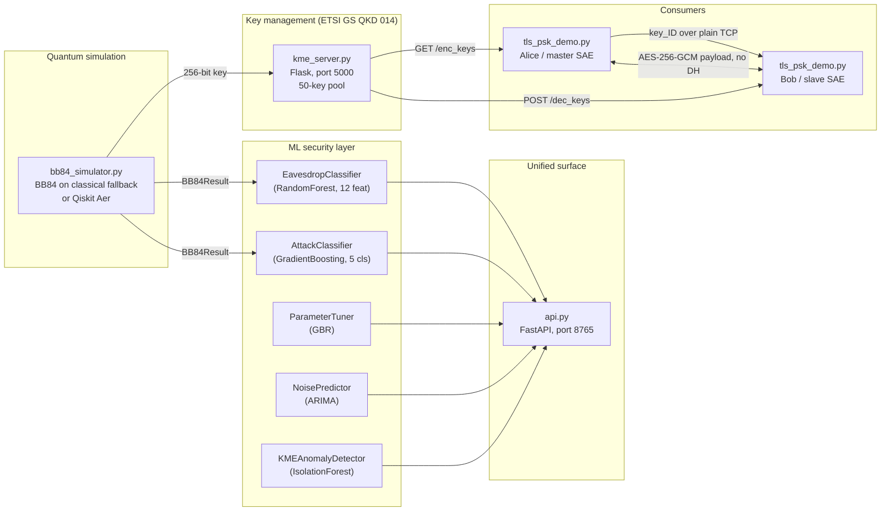

# MVP Architecture

The full system architecture is in `../../DOCS/system-architecture-diagram.md`
(five Mermaid diagrams covering the production-shaped pipeline). This document
shows the **MVP slice** — the subset of the architecture that
`poc/scripts/run_mvp.sh` actually exercises end-to-end.

## MVP pipeline (the slice that runs)

## What lives where

| Layer | File | Process | Port | Lifecycle in `run_mvp.sh` |
|-------|------|---------|------|---------------------------|
| Quantum sim | `bb84_simulator.py` | in-process | — | Imported by every script |
| KME | `kme_server.py` | Flask | 5000 | Started in step 3, killed at step end |
| PSK Bob | `tls_psk_demo.py server` | Python sock | 8443 | Started in step 3, killed at step end |
| PSK Alice | `tls_psk_demo.py client` | Python sock | — | Foreground call in step 3 |
| Unified API | `api.py` | Uvicorn | 8765 | Started in steps 4 & 5, killed at end of each |
| Models | `data/*.pkl` + `noise_series_dataset.csv` | on disk | — | Loaded once at FastAPI startup |

## The 12-feature contract

Every classifier in the MVP consumes the same feature vector, defined once
in `implementation/features.py`. The contract is:

| # | Feature | Range | Source |
|---|---------|-------|--------|
| 0 | qber | 0.0–0.5 | direct |
| 1 | sift_ratio | 0.0–1.0 | direct |
| 2 | error_variance | 0.0–0.25 | direct |
| 3 | max_burst_length | int | direct |
| 4 | low_block_fraction | 0.0–1.0 | direct |
| 5 | high_block_fraction | 0.0–1.0 | direct |
| 6 | error_autocorrelation | -1.0–1.0 | direct |
| 7 | sift_deviation | 0.0–0.4 | direct |
| 8 | variance_ratio | 0.0–1.0 | derived (physics) |
| 9 | block_entropy | 0.0–3.0 | derived (physics) |
| 10 | burst_qber_product | 0.0–10.0 | derived (physics) |
| 11 | block_kurtosis | -3.0–10.0 | derived (physics) |

Features 0–7 are direct measurements from the BB84 protocol run.
Features 8–11 are non-linear physics-derived quantities — they make the
attack surface harder to evade, because an evolved attacker has to produce
internally-consistent values across all twelve dimensions, not just the
first eight. (The longer story is in `../../implementation/ADVERSARIAL_FINDINGS.md`.)

## What is *not* in the MVP slice

These exist in `implementation/` but `run_mvp.sh` does not start them:

- `kme_dual.py` — paired Alice/Bob KMEs with peer sync
- `relay_network.py` — XOR-based trusted-node relay across multiple hops
- `hybrid_kdf.py` — HKDF combining QKD output with ML-KEM (PQC)
- `adversarial_gym.py` — DEAP evolutionary co-evolution
- `vendor_*.py` — adapters for IDQ, Toshiba, QuantumCTek, QuintessenceLabs
- `frontend/` — React + D3 dashboard

They are real, runnable, and tested individually, but they extend the MVP
rather than constitute it.
